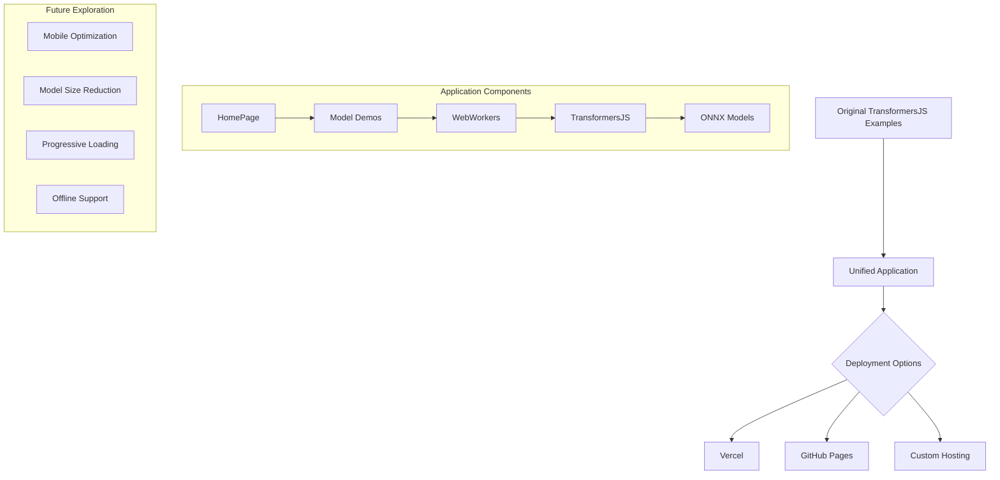

# TransformersJS Examples

This repository contains a collection of example applications demonstrating the capabilities of [TransformersJS](https://github.com/huggingface/transformers.js), allowing you to run machine learning models directly in the browser. This project provides a unified application that combines multiple models into a single cohesive experience.

> **Important**: This project builds upon the original examples from [huggingface/transformers.js-examples](https://github.com/huggingface/transformers.js-examples). Please star and watch the original repository for updates and new examples.

## 🌟 Features

- **Multiple Models in One App**: Collection of TransformersJS examples integrated in a single application
- **Flexible Deployment Options**: Ready for Vercel, GitHub Pages, or your preferred hosting
- **WebGPU Support**: Hardware acceleration for compatible browsers and models
- **Cross-Origin Isolation**: Properly configured headers for SharedArrayBuffer support

## 🧩 Included Models & Examples

The application includes examples for various machine learning tasks:

| Model | Description | WebGPU |
|-------|-------------|--------|
| Llama 3.2 | Text generation using Llama 3.2 | ⚡ Required |
| Phi 3.5 | Text generation using Phi 3.5 | ⚡ Required |
| Janus | Multimodal text generation with image capabilities | ⚡ Required |
| Florence 2 | Vision model for image understanding and captioning | ⚡ Required |
| Cross Encoder | Text similarity and relevance scoring | No |
| Zero-Shot Classification | Classify text without specific training | No |
| SpeechT5 | Convert text to speech | No |
| Text-to-Speech | Generate speech from text with acceleration | ⚡ Required |

## 🚀 Getting Started

### Local Development

```bash
# Install dependencies
npm install

# Start the development server
npm run dev
```

### Deployment Options

This repository is configured for several deployment options:

#### Vercel Deployment

The included `vercel.json` file configures:
- SPA routing for React Router
- Cross-Origin Isolation headers (COOP/COEP)
- Caching for static assets

```bash
# Install Vercel CLI
npm install -g vercel

# Deploy
vercel
```

#### Other Hosting Platforms

When deploying to other platforms, ensure you configure:

1. SPA routing (all routes redirected to index.html)
2. Cross-Origin Isolation headers:
   - `Cross-Origin-Embedder-Policy: require-corp`
   - `Cross-Origin-Opener-Policy: same-origin`

## 📋 Project Structure

```
├── src/                # Source code for the unified application
│   ├── demos/          # Individual model demos
│   ├── App.jsx         # Main application with routing
│   └── HomePage.jsx    # Directory of available demos
├── public/             # Static assets
├── index.html          # HTML entry point
├── vercel.json         # Deployment configuration for Vercel
├── vite.config.js      # Vite configuration
└── package.json        # Dependencies and scripts
```

## 🔧 Technical Details

- **Framework**: React with Vite
- **Styling**: Tailwind CSS
- **Routing**: React Router with SPA routing
- **Model Loading**: Web Workers for non-blocking UI
- **Acceleration**: WebGPU for supported models and browsers

### Cross-Origin Isolation

Many machine learning models require SharedArrayBuffer, which needs proper cross-origin isolation. The application is configured with the necessary headers for this functionality.

### Mobile Compatibility

While the examples work well on desktop browsers with WebGPU support, mobile compatibility is still being investigated. Contributions and observations in this area are particularly welcome.

## 🔍 What's Next?

This repository serves as a starting point for exploring TransformersJS capabilities. Some areas for further exploration:

- Optimizing for mobile devices
- Reducing model size for faster loading
- Implementing progressive loading strategies
- Custom model fine-tuning integration
- Offline support with service workers

## 🙏 Credits

- Original examples from [huggingface/transformers.js-examples](https://github.com/huggingface/transformers.js-examples) - worth starring and watching!
- Models converted to ONNX from [Hugging Face](https://huggingface.co)
- TransformersJS library by [Hugging Face](https://github.com/huggingface/transformers.js/)
- Individual code examples from the TransformersJS community

## 🤝 Contributing

If you are interested in contributing to the underlying examples, check out the [transformers.js examples repository](https://github.com/huggingface/transformers.js-examples).

For issues specific to this unified application, please open an issue here.

## 📄 License

This project is licensed under the terms specified by Hugging Face:
- https://github.com/huggingface/transformers.js/blob/main/LICENSE
- https://github.com/huggingface/transformers.js-examples/blob/main/LICENSE

## 📊 Project Architecture

