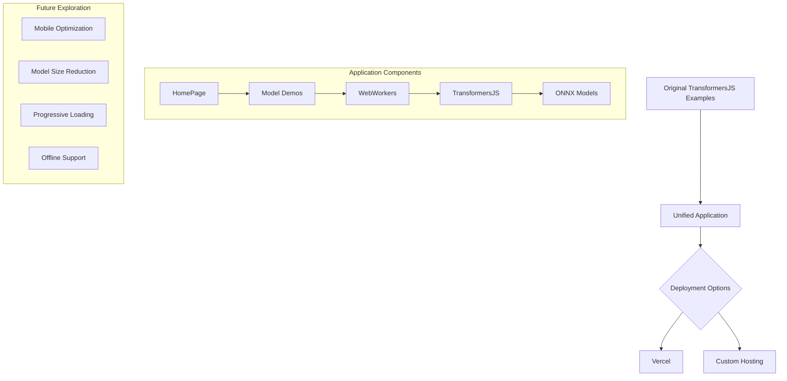

# TransformersJS Examples

This repository contains a collection of example applications demonstrating the capabilities of [TransformersJS](https://github.com/huggingface/transformers.js), allowing you to run machine learning models directly in the browser. This project provides a unified application that combines multiple models into a single cohesive experience.

**Live site:** https://transformersjs-examples.vercel.app

> **Important**: This project builds upon the original examples from [huggingface/transformers.js-examples](https://github.com/huggingface/transformers.js-examples). Please star and watch the original repository for updates and new examples.

## 🌟 Features

- **Multiple Models in One App**: Collection of TransformersJS examples integrated in a single application
- **Deployment**: Configured for Vercel; other hosts work if they provide SPA routing and the COOP/COEP headers
- **In-Browser Inference**: Models run client-side on WebAssembly (ONNX Runtime), with no backend
- **Cross-Origin Isolation**: Properly configured headers for SharedArrayBuffer support

## 🧩 Included Models & Examples

The application includes examples for various machine learning tasks:

| Model | Description | Model ID | Backend |
|-------|-------------|----------|---------|
| Decide | Auto-route or escalate a support ticket using a calibrated confidence threshold | onnx-community/open-jev-deberta-v3-large-ONNX (via `open-jev`) | Preferred (WASM fallback) |
| Cross Encoder | Text similarity and relevance scoring | mixedbread-ai/mxbai-rerank-xsmall-v1 | WASM |
| Zero-Shot Classification | Classify text without specific training | MoritzLaurer/deberta-v3-xsmall-zeroshot-v1.1-all-33 | WASM |

## 🚀 Getting Started

### Local Development

```bash
# Install dependencies
npm install

# Start the development server
npm run dev
```

### Deployment Options

This repository is configured for Vercel. Other hosts need the same SPA rewrite and headers.

#### Vercel Deployment

The included `vercel.json` file configures:
- SPA routing for React Router
- Cross-Origin Isolation headers (COOP/COEP)
- Caching for static assets

```bash
# Install Vercel CLI
npm install -g vercel

# Deploy
vercel
```

#### Other Hosting Platforms

When deploying to other platforms, ensure you configure:

1. SPA routing (all routes redirected to index.html)
2. Cross-Origin Isolation headers:
   - `Cross-Origin-Embedder-Policy: require-corp`
   - `Cross-Origin-Opener-Policy: same-origin`

Hosts that cannot set response headers, such as GitHub Pages, still run the demos, but without cross-origin isolation ONNX Runtime falls back to single-threaded WASM. GitHub Pages also needs a `404.html` fallback for deep links and a Vite `base` for project sites; neither is set up here.

## 📋 Project Structure

```
├── src/                # Source code for the unified application
│   ├── demos/          # Individual model demos (App.jsx UI + worker.js inference)
│   ├── utils/          # Shared worker runtime and viewport-height fix
│   ├── App.jsx         # Main application with routing
│   ├── Layout.jsx      # App shell (header, scrolling content area, footer)
│   └── HomePage.jsx    # Directory of available demos
├── docs/decide.md      # /decide method, results, lessons and sources
├── tools/decide-calibration/  # Rebuild and check /decide's calibration data
├── index.html          # HTML entry point
├── vercel.json         # Deployment configuration for Vercel
├── vite.config.js      # Vite configuration
└── package.json        # Dependencies and scripts
```

## 🔧 Technical Details

- **Framework**: React with Vite
- **Styling**: Tailwind CSS
- **Routing**: React Router with SPA routing
- **Model Loading**: Web Workers for non-blocking UI
- **Inference**: ONNX Runtime WebAssembly, multi-threaded when the page is cross-origin isolated

### Mobile Compatibility

While the examples work well on desktop browsers, mobile compatibility is still being investigated. Contributions and observations in this area are particularly welcome.

## 🔍 What's Next?

This repository serves as a starting point for exploring TransformersJS capabilities. Some areas for further exploration:

- Optimizing for mobile devices
- Investigate alternative loading strategies for hybrid online / offline use cases
- Leveraging tools from the [HF ONNX Community](https://huggingface.co/onnx-community) to convert and add models

## 🙏 Credits

- Original examples from [huggingface/transformers.js-examples](https://github.com/huggingface/transformers.js-examples) - worth starring and watching!
- Models converted to ONNX from [Hugging Face](https://huggingface.co)
- TransformersJS library by [Hugging Face](https://github.com/huggingface/transformers.js/)
- Individual code examples from the TransformersJS community

## 🤝 Contributing

If you are interested in contributing to the underlying examples, check out the [transformers.js examples repository](https://github.com/huggingface/transformers.js-examples).

For issues specific to this unified application, please open an issue here.

## 📄 License

This project is licensed under the terms specified by Hugging Face:
- https://github.com/huggingface/transformers.js/blob/main/LICENSE
- https://github.com/huggingface/transformers.js-examples/blob/main/LICENSE

## 📊 Project Architecture


```mermaid
graph TD
    A[Original TransformersJS Examples] --> B[Unified Application]
    B --> C{Deployment Options}
    C --> D[Vercel]
    C --> F[Custom Hosting]
    
    subgraph "Application Components"
    G[HomePage] --> H[Model Demos]
    H --> I[WebWorkers]
    I --> J[TransformersJS]
    J --> K[ONNX Models]
    end
    
    subgraph "Future Exploration"
    L[Mobile Optimization]
    M[Model Size Reduction]
    N[Progressive Loading]
    O[Offline Support]
    end
```