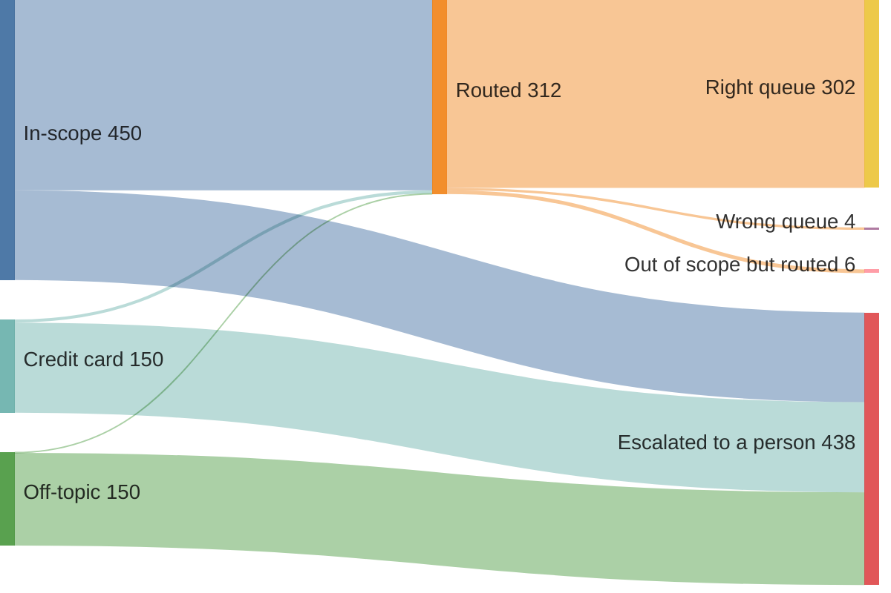
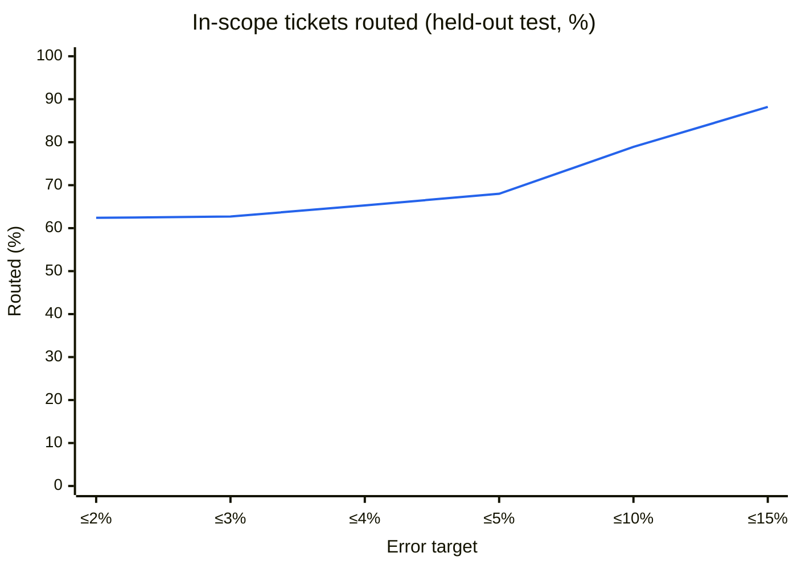
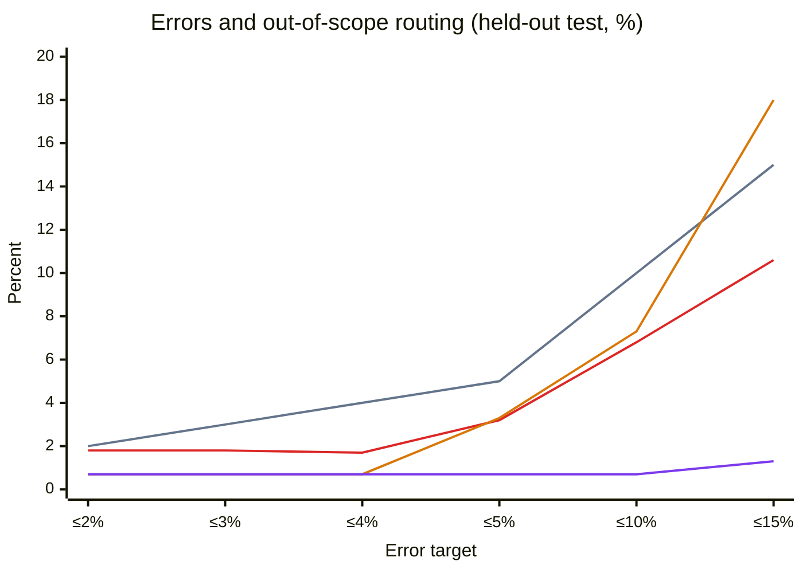

# /decide: calibrated act-or-escalate

`/decide` routes a support ticket automatically only when the model's top label clears a
threshold certified for an error target; everything else goes to a person. Inference runs in
the browser (open-jev, DeBERTa-v3-large, ONNX via Transformers.js), so ticket text never leaves
the tab.

This document records how the shipped numbers were produced, what was learned on the way, and
what the page can and cannot claim. Rebuild and check the data with
[`tools/decide-calibration/`](../tools/decide-calibration/README.md). Diagrams of the harness, one
ticket's path through the browser, and a proposed fine-tuning loop: [`docs/harness.md`](harness.md).

## How a decision is made

1. open-jev answers one multiple-choice question ("Which request is the bank customer
   making?") over 15 banking labels plus `other` ("something else"), each with an optional
   scope note. It returns a probability per label.
2. **Act** when the top label is not `other` and its probability is at least the threshold;
   otherwise **escalate**. An action is an error if the label is wrong or the ticket was out of
   scope.
3. The threshold is the loosest value, scanned from 0.99 down in 0.01 steps, whose one-sided
   Clopper-Pearson 95% upper bound on acted-on error stays within the target (fixed-sequence
   testing, as in Learn-then-Test). The scan starts at the first threshold that acts on enough
   calibration tickets for the target to be reachable at all: the smallest n with
   1 − 0.05^(1/n) ≤ target (59 at 5%, 99 at 3%), and never fewer than 60. That start depends
   only on the target and the scores, never on the labels, so the guarantee is kept. Code: `src/demos/decide/calibration.js`; Python twin:
   `tools/decide-calibration/analyze.py`. They agree on every spike score file
   (`parity.mjs`).

## Data

CLINC150 (`clinc/clinc_oos`, "plus"; Larson et al. 2019, CC BY 3.0) stands in for a support
queue: 15 deposit-account banking intents are in scope, 15 credit-card intents are near
out-of-scope ("another team's queue"), and CLINC's `oos` rows are far out-of-scope.

| Split | Source | Rows | Used for |
|-------|--------|------|----------|
| Dev | CLINC validation | 300 banking + 150 credit + 100 oos | Writing label scope notes (from confident errors) |
| Calibration | CLINC train, seed 20261004 | 20 per banking intent (300) + 10 per credit intent (150) + 100 oos | Choosing the threshold |
| Test | CLINC test | 450 banking + 150 credit + 150 oos | Reporting results; also used by the spike to compare models |

The three splits share no text. The test split is not pristine, though: the spike compared eight
model and label-note setups on these same 750 tickets and chose open-jev with notes partly on
that basis, so the test numbers below are mildly optimistic as estimates for new traffic. The
95% guarantee is computed on the calibration split only and is unaffected. The two mixes also
differ: calibration is 300 in-scope / 150 credit-card / 100 off-topic (55/27/18%), test is
450/150/150 (60/20/20%). The bound covers acted-on error under the calibration mix; a queue
with more out-of-scope traffic can see a higher error rate. Scores were computed in Chrome 154 (Windows) with q4f16 on
WebGPU (`tools/decide-calibration/provenance.json`): 357 MB download, 0.8 s first call (model and GPU shader cache already warm; about 4 s cold),
364 ms p50 / 373 ms p90 per ticket.

## Shipped results (held-out test)

| Error target | Threshold | In-scope routed | Error when acting | Credit-card routed | Off-topic routed |
|--------------|-----------|-----------------|-------------------|--------------------|------------------|
| ≤1% | none: escalate everything | 0% | – | 0% | 0% |
| ≤2% | 0.52 | 62.4% | 1.8% | 0.7% | 0.7% |
| ≤3% | 0.51 | 62.7% | 1.8% | 0.7% | 0.7% |
| ≤4% | 0.48 | 65.3% | 1.7% | 0.7% | 0.7% |
| ≤5% (default) | 0.45 | 68.0% | 3.2% | 3.3% | 0.7% |
| ≤10% | 0.38 | 78.9% | 6.8% | 7.3% | 0.7% |
| ≤15% | 0.32 | 88.2% | 10.6% | 18.0% | 1.3% |

Error when acting stayed under the target at every certified threshold. At ≤1% no threshold
qualifies, and it fails on errors, not sample size: the calibration split can act on up to 500
tickets, but the first threshold acting on 299 or more is 0.31, where 40 of 305 routed tickets are
wrong (bound 16.7%). There is one split per condition and no repeated runs, so differences of a
few points are within sampling noise. `node tools/decide-calibration/eval-shipped.mjs` re-derives
this table and the charts below from the shipped files.

**Where the 750 test tickets go at the default ≤5% target (threshold 0.45).**

*312 tickets are routed; 10 of them are errors (4 wrong queue, 6 out of scope), the 3.2% in the
table. The other 438 go to a person.*

**How coverage and errors move with the target.**

*Blue: share of the 450 in-scope tickets routed automatically. The axis starts at ≤2% because
there is no threshold at ≤1%, and its targets are unevenly spaced (2, 3, 4, 5, 10, 15%).*

*Slate: the target itself. Red: error when acting, which stays below the slate line at every
target. Orange: share of the 150 credit-card questions routed. Purple: share of the 150 off-topic
messages routed. Orange and purple overlap at 0.7% from ≤2% to ≤4%, and red and orange nearly
coincide at ≤5% (3.2% vs 3.3%). Same uneven x-axis spacing as
above; the guarantee covers the red line only, not the leak lines.*

## Lessons

These affect correctness; read them before changing labels, models or data.

1. **The guarantee only holds if the splits stay separate.** Write label notes from a dev split,
   choose the threshold on a separate calibration split, and report from a test split that played
   no part in any choice (this repo's test split falls short of that; see Data).
   The spike broke this once: its scope notes were written from confusions on CLINC
   validation, and its "+desc" threshold was then certified on that same set. Test error
   happened to stay under target, but the 95% guarantee was not valid. The clean split restores
   it. The numbers moved in both directions, and the move can't be attributed to the leak alone
   because the runtime changed too:

   | Run | Calibration data | Runtime | Threshold (≤5%) | In-scope routed | Error when acting |
   |-----|------------------|---------|-----------------|-----------------|-------------------|
   | Spike | CLINC validation (leaky) | Node, q4, CPU | 0.50 | 64.4% | 1.7% |
   | Spike | CLINC validation (leaky) | Chrome, q4f16, WebGPU | 0.52 | 62.4% | 1.8% |
   | Shipped | CLINC train (clean) | Chrome, q4f16, WebGPU | 0.45 | 68.0% | 3.2% |

   The shipped notes are byte-identical to the spike's: they were written from the spike
   calibration set, which is now the dev split.
2. **Scores belong to one exact setup.** They are valid for one label set and one model build:
   label text, scope notes, question, dtype and device. Any change means re-scoring. q4 (CPU)
   and q4f16 (WebGPU) disagree on the top label for 10 of 750 spike test items (1.3%; max
   per-label probability difference 0.044).
3. **The threshold search needs a minimum sample, sized to the target.** A threshold is only
   tested once it acts on at least n calibration items, where n is the smallest sample whose
   zero-error 95% bound meets the target, 1 − 0.05^(1/n) ≤ target: 59 at 5% (CP(0,59) = 4.95%,
   CP(0,58) = 5.03%), 74 at 4%, 99 at 3%, 149 at 2%, 299 at 1%, never fewer than 60. Start too
   small and the strictest thresholds act on a handful of items, fail the bound and stop the
   scan: with no floor, every spike model came back "no safe threshold". A fixed floor of 60
   had the opposite flaw: 0 errors in 60 only bounds 4.87%, so every target below ~4.9% failed
   its first test and the page reported no threshold at ≤2–4% even though 0.52, 0.51 and 0.48
   qualify (caught in review, fixed 2026-10-04). The start depends only on the target and the
   scores, not the labels, so the guarantee holds. It also sizes the calibration set: ≤1% needs
   at least 299 acted-on tickets with zero errors. Here ≤1% fails on errors, not sample size: the
   calibration split can act on up to 500 tickets, but the first threshold acting on 299 or more is
   0.31, where 40 of 305 routed tickets are wrong (bound 16.7%).
4. **Label scope notes are the biggest lever.** At the ≤5% target on the spike split, notes took
   GLiNER2.5-Decide from 0% to 18.5% of all tickets routed and open-jev from 14.1% to 38.9%:
   more than switching models did. Write them from confident errors on the dev split, never
   from calibration or test.
5. **The guarantee bounds total error on routed tickets, not leak per group.** At ≤5%, 3.3% of
   credit-card questions are still routed (for example "I want to report a stolen card" →
   report fraud, 0.47), and at ≤15% it is 18.0%. A per-group limit needs its own risk control,
   a card-services label, or a separate out-of-scope check.
6. **Judge by coverage and error at the target, not by calibration error.** Encoder confidences
   are underconfident, so ECE looks poor (open-jev 15–30% on the spike) even where the gate
   works well. Acting on singleton split-conformal sets (α = 0.10) gave unstable coverage
   (singleton sets for 2–80% of test tickets across models) and no control of acted-on error: with
   notes, open-jev's conformal singletons routed 17.2% at 0% error versus the ≤10% gate's
   43.7% at 4.3%; without notes they routed 53.9% at 10.4% error, over the 10% level.
   Conformal α bounds miscoverage, not the error of auto-routed tickets; the Clopper-Pearson
   gate targets that error directly.
7. **Runtime gotchas.**
   - open-jev's progress `total` only counts files that have started downloading, so it jumps
     when the large weights file starts. Use `OpenJev.info().downloadSize` as the denominator.
   - The first call compiles GPU shaders (about 0.8–4 s). The worker warms up before reporting
     ready.
   - Under COOP/COEP, `workerRuntime.js` must keep both `wasmPaths.mjs` and `wasmPaths.wasm` set
     to the self-hosted runtime (PR #5). Otherwise ONNX Runtime's pthreads load the demo worker
     bundle and can crash it.
   - Playwright in WSL has no GPU: WebGPU numbers must come from a real Chrome.
   - Long browser runs should save partial results as they go (the scorer saves every 100
     items).
8. **Model landscape facts that are easy to get wrong** (checked 2026-10-03).
   - GLiNER2.5-Decide is not supported by the published `open-jev` package (0.1.2, 2026-09-21);
     open [PR #1](https://github.com/nico-martin/open-jev/pull/1) adds it. The ONNX export
     (`onnx-community/GLiNER2.5-Decide-ONNX`) is usable with your own encoding code.
   - Fastino's "JevK5" is an open reproduction, not TypeSafe's Jev: Fastino's
     [launch post](https://fastino.ai/blog/gliner-2-5-decide-open-weight-decision-model) says so,
     but the model card lists "JevK5 57.6%" without that caveat.
   - Jev is a closed API: TypeSafe's [model docs](https://docs.typesafe.ai/models.md) price it
     per input token and say the same weights serve every account. No downloadable weights or
     self-hosting were found (inferred from the docs and secondary coverage). TypeSafe's public
     docs report no calibration metrics (ECE, Brier score, reliability diagrams) as of
     2026-10-03. That is an absence in the docs, not a finding that Jev is uncalibrated.

### Spike model comparison (≤5% target)

Spike split, same 750 test tickets. Rows with scope notes were calibrated on the same CLINC
validation set the notes were written from, so their thresholds are not valid guarantees; rows
without notes never used validation for anything else, so theirs are. "Routed" is the share of all test tickets acted on.
The Chrome row was run after the choice, to check that the chosen setup held up in a browser;
it was not a candidate.

| Model | Runtime | Notes | In-scope top-1 | Threshold | Routed | Error when acting | p50 |
|-------|---------|-------|----------------|-----------|--------|-------------------|-----|
| open-jev (DeBERTa-v3-large) | Chrome, q4f16, WebGPU | yes | 92.4% | 0.52 | 37.7% | 1.8% | 367 ms |
| open-jev | Node, q4, CPU | yes | 92.2% | 0.50 | 38.9% | 1.7% | 526 ms |
| open-jev | Node, q4, CPU | no | 93.6% | 0.95 | 14.1% | 0.9% | 197 ms |
| GLiNER2.5-Decide | Node, q4, CPU | yes | 90.4% | 0.96 | 18.5% | 2.2% | 699 ms |
| GLiNER2.5-Decide | Node, q4, CPU | no | 93.1% | none | 0% | – | 218 ms |
| kev-0.6b | Node, q4, CPU | no | 58.4% | 0.92 | 16.5% | 3.2% | 280 ms |
| NLI ModernBERT-base | Node, q8, CPU | no | 72.9% | none | 0% | – | 272 ms |
| NLI DeBERTa-v3-xsmall | Node, q8, CPU | no | 71.6% | none | 0% | – | 178 ms |

Source: `tools/decide-calibration/report.json`.

### How the model was selected

The research session picked open-jev with scope notes during the spike on 2026-10-03 and
recommended it in the published spike results. The user approved the spike plan and then asked
for /decide to be built on that recommendation, but was not asked to choose between models.
This account is from that session's record.

- **Deciding number:** coverage at a certified ≤5% target, measured on the 750 test tickets:
  open-jev with notes routed 38.9% at 1.7% error, GLiNER2.5-Decide with notes 18.5% at 2.2%,
  and the NLI models and GLiNER2.5-Decide without notes had no qualifying threshold: the notes,
  more than the model, unlocked coverage. In-scope top-1 was nearly tied (93.6% vs 93.1%
  without notes) and played no part; ECE was set aside because both large encoders were
  underconfident (lesson 6). Validation numbers were not used to choose between models.
- **Tie-breakers, not weighted formally:** open-jev ships in the published `open-jev` npm
  package (0.1.2), while GLiNER2.5-Decide needed unmerged open-jev PR #1 built by hand; smaller
  q4f16 weights (348 MB vs 523 MB); lower CPU latency (526 ms vs 699 ms with notes). They
  would have decided it had the coverage gap been small.
- **The comparison favored two models.** Scope notes were written from the confident errors of
  open-jev and GLiNER2.5-Decide on the validation set, and only those two got a with-notes run.
  The NLI models and kev-0.6b were compared with plain labels only.
- **Selection used the test split.** The choice was made on the same 750 tickets that became the
  shipped test split, after notes were tuned on two of the candidates. That is a second reason,
  beyond the test reuse noted under Data, to read the shipped test numbers as mildly optimistic.
- **Noise.** One split, no repeated runs. The 38.9% vs 18.5% gap is large enough to matter;
  smaller gaps in the table (open-jev without notes 14.1% vs kev-0.6b 16.5%) are within noise.
- **Not tried.** Before `score.mjs`, only one-sentence smoke tests confirmed that open-jev and
  GLiNER2.5-Decide loaded. Earlier research screened out, without scoring: GLiClass (custom
  decoding, no stock pipeline), fastino's GLiGuard-300M and Arch-Router-1.5B (no ONNX build, and a
  different task), and GLiNER2.5-small (no ONNX build). kev-4b was not considered: its
  2.3–2.5 GB download needs a capable GPU, which rules it out for an in-browser demo on
  integrated graphics. No fine-tuned classifier was tried; every candidate was zero-shot, though
  the cited cost studies suggest a fine-tuned DeBERTa or ModernBERT would be a strong baseline.
  Staying zero-shot keeps labels editable in the browser with recalibration only, no retraining;
  that rationale was stated after the selection, not argued at the time.
- **Threshold-start fixes.** The spike's first analysis started the scan at 0.99 with only a
  handful of tickets, so every model returned "no threshold". The ≥60-ticket floor was added
  before any selection. The target-aware start (PR #14) leaves the 5% and 10% spike results
  unchanged.

## Why typed decisions

The `/decide` page carries a short version of this, closed by default, with its numbers
computed live from the shipped data.

- **The problem.** Much enterprise AI work is high-volume routing and classification (tickets,
  claims, alerts, documents), not open-ended chat.
- **Cost and speed (cited).** On narrow classification and intent tasks, fine-tuned small
  encoders matched or beat zero/few-shot frontier LLMs at roughly 100–400× lower cost per
  request, and answered in milliseconds; the LLMs were better at spotting out-of-scope inputs.
  /decide itself uses a general-purpose encoder (open-jev) with no task-specific fine-tuning;
  fine-tuning on a customer's labeled tickets is a further step these studies support.
  Two 2026 preprints, not peer reviewed:
  - [arXiv:2602.06370](https://arxiv.org/abs/2602.06370), Valdes Gonzalez, *Cost-Aware Model
    Selection for Text Classification*. Cost per 1M requests: DistilBERT $5–13 vs few-shot
    Claude $600–2,700, about 115× (SST-2) to 384× (DBPedia). LLMs at list price; encoders on
    modelled Cloud Run CPU.
  - [arXiv:2608.20371](https://arxiv.org/abs/2608.20371), Rodrigues & Vas, *When Do LLMs
    Replace Fine-Tuned NLU?* ATIS: RoBERTa 95.9 vs zero-shot Claude Haiku 4.5 84.1; CLINC150
    89.1 vs 88.5. Out-of-scope recall: Haiku 85.6 vs RoBERTa 58.1. Latency 0.1–2.4 ms local
    vs 981 ms p50 for the API.
- **Act only when safe (measured here).** The page routes automatically only when the bound on
  acted-on error meets the target, and shows the measured coverage and error.
- **Privacy.** Inference runs in the browser tab; the model is fetched once from the Hugging
  Face Hub, and ticket text never leaves the device.
- **Honest limits.** CLINC is a clean benchmark, not real tickets. Some near out-of-scope
  questions still get routed. Labels need tuning for each queue, and real traffic drifts, so
  recalibrate on it.
- **How an FDE would deploy it.** Swap in the customer's queues; write scope notes from a dev
  sample's confident errors; calibrate on a few hundred labeled tickets; measure on a held-out
  set; monitor and recalibrate as traffic drifts.
- **Context.** TypeSafe sells this confidence-routing pattern as a closed API (Jev; see its
  [confidence routing pattern](https://docs.typesafe.ai/patterns/confidence-routing.md)). This
  page is an open, inspectable version built from open models: a comparison of approach, not a
  claim of equivalence.
