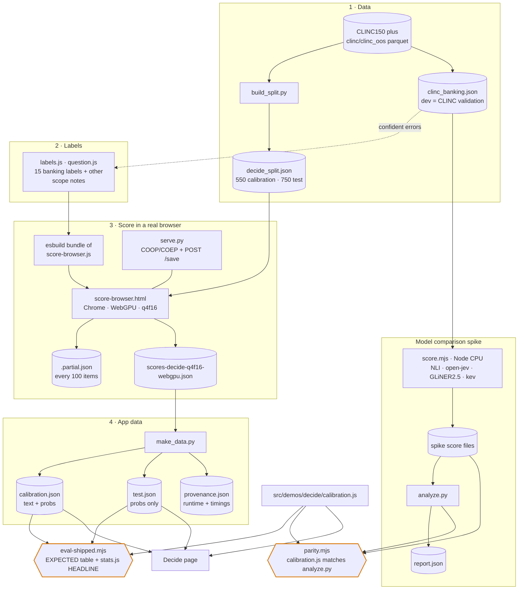
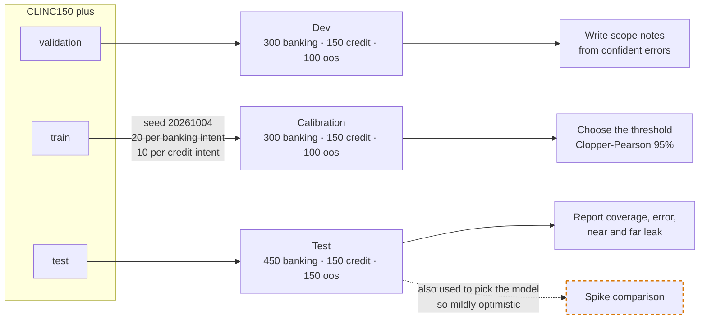
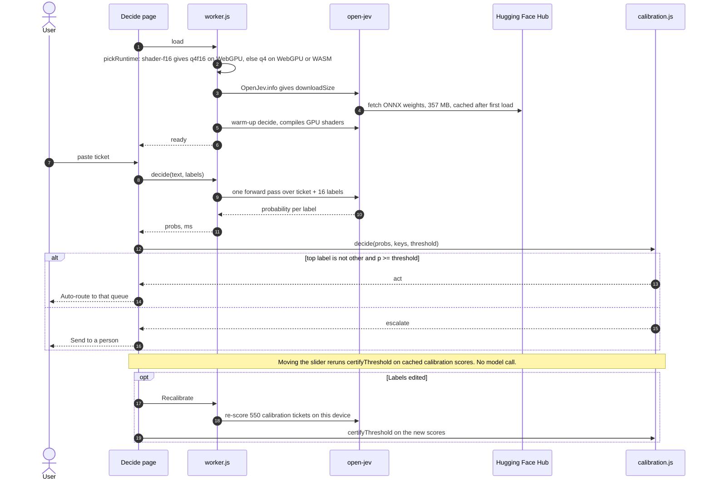
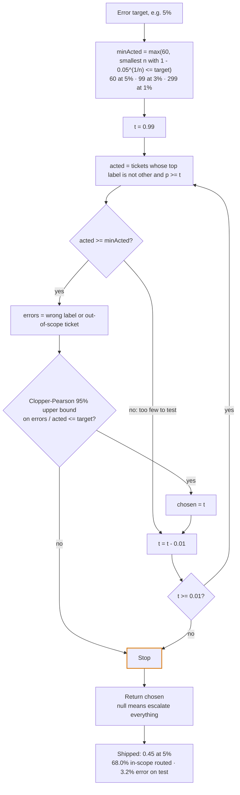
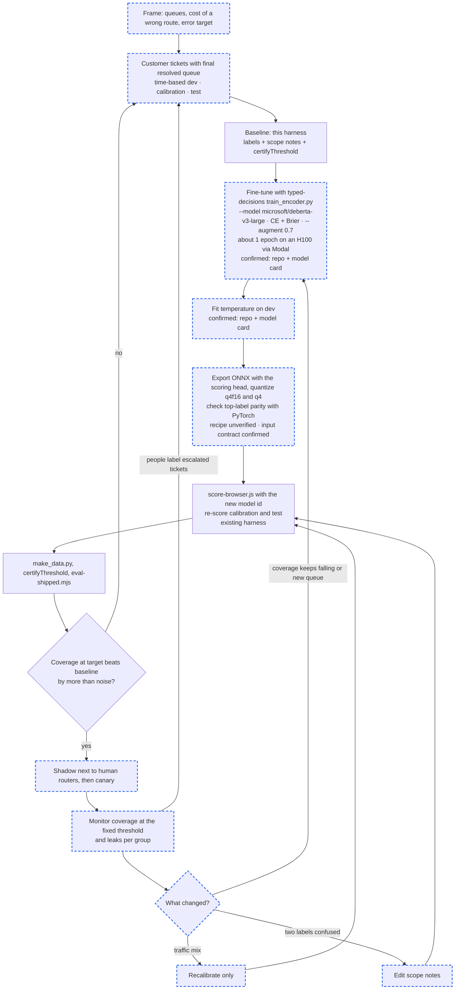

# The calibration harness behind /decide

How CLINC150 tickets become the shipped threshold, how one ticket is decided in the browser, and where a fine-tuned model would plug in. Built from the code in `tools/decide-calibration/` and `src/demos/decide/` as of 2026-10-04. Method, results and lessons: [`docs/decide.md`](decide.md); commands: [`tools/decide-calibration/README.md`](../tools/decide-calibration/README.md).

**Note on the model's training data.** open-jev was trained on `mteb/banking77` (customer banking messages, 77 intents) plus SST-5 and BoolQ ([model card](https://huggingface.co/com-kotobalabs/open-jev-deberta-v3-large)). That is the same domain as the CLINC150 banking intents used here, so /decide's "zero-shot" labels sit close to what the model was trained on. Read the shipped numbers as in-domain, and expect lower coverage on a queue from another domain.

## Harness map

Every file in tools/decide-calibration and what it produces. Solid arrows are data; hexagons are checks that fail the build when numbers drift.

## Three splits, three jobs

The guarantee holds only if no text crosses these lines. Scope notes come from dev, the threshold from calibration, the reported numbers from test.

## One ticket at runtime

What happens in the tab. The model call returns probabilities; the act-or-escalate decision is plain arithmetic on them.

## certifyThreshold

Fixed-sequence testing from strict to loose. The first failure stops the scan, which is what keeps the 95% guarantee valid across all the thresholds it looked at.

## Fine-tuning loop

Proposed, not built yet. Dashed boxes are new work; solid boxes reuse the harness above unchanged. Each step is tagged with how far it has been checked (2026-10-04); details in the table below.

### What has been checked in the fine-tuning loop

| Step | Status | What was checked |
|------|--------|------------------|
| F3 training script and flags | Confirmed (repo) | [`kotoba-lang/typed-decisions`](https://github.com/kotoba-lang/typed-decisions) (Apache-2.0) has `src/typed_decisions/train_encoder.py` with `--model`, `--augment` (a probability, so `--augment 0.7`), `--brier-weight` and `--epochs`. Its default model is ModernBERT-large, so DeBERTa needs `--model microsoft/deberta-v3-large`. `modal_app.py` runs it on an H100 via Modal. |
| F3 recipe and cost | Confirmed (model card), for open-jev's own run | CE + Brier loss; gold-preserving question augmentation at p = 0.7; 1 epoch, seed 2, one H100, 229 s, about $0.25, on 18,000 train states (banking77 + SST-5 + BoolQ). A run on CLINC rows is a different size; its cost is an estimate until measured. |
| F4 temperature | Confirmed (repo + model card) | `train_encoder.py` fits a post-hoc temperature on the validation split (`fit_temperature`); the shipped model's is 1.05. |
| F5 ONNX export | Recipe unverified | `typed-decisions` contains no ONNX export code, and the [ONNX conversion](https://huggingface.co/onnx-community/open-jev-deberta-v3-large-ONNX) publishes no conversion script. A fine-tuned export has to be built and checked from scratch (top-label parity against PyTorch). |
| F5 input contract | Confirmed | The ONNX repo's `config.json` (`open_jev` section) and open-jev's JS encoder agree: `[CLS] [STATE] state [Q] question [OPT] option … [SEP]`, inputs `input_ids`, `attention_mask`, `seg`, `pair_q`, `pair_opt`, one logit per (question, option) pair. A fine-tuned model runs in /decide unchanged **if** its export includes the 3-layer scoring head (`head.safetensors`) with those inputs, and its `config.json` sets `open_jev.temperature` to the fitted value: the open-jev library reads the temperature from there (default 1.05). |
| F6–F7 | Existing harness | `score-browser.js` → `make_data.py` → `certifyThreshold` → `eval-shipped.mjs`, unchanged apart from the model id. |
| F0–F2, F8, monitoring | Proposed process | Not claims to verify; how a deployment would run. |

Trade-off to keep in view: a fine-tuned label set is fixed at training time. /decide's in-browser label editing plus recalibration would no longer be enough; changing a queue means retraining and re-exporting.

Sources: `docs/decide.md`, `tools/decide-calibration/README.md`, `calibration.js`, `worker.js`, `score-browser.js`; the open-jev [model card](https://huggingface.co/com-kotobalabs/open-jev-deberta-v3-large) and [ONNX repo](https://huggingface.co/onnx-community/open-jev-deberta-v3-large-ONNX); [`kotoba-lang/typed-decisions`](https://github.com/kotoba-lang/typed-decisions) (checked 2026-10-04).
